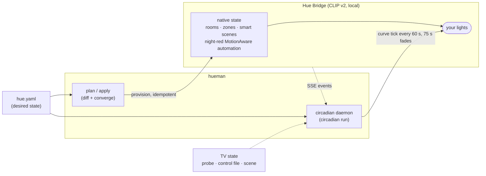
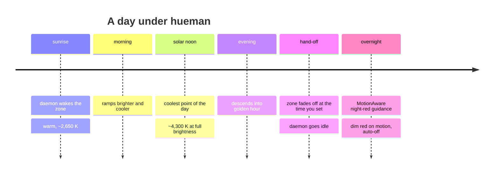

# hueman

Declarative, Terraform-style management of Philips Hue lighting — a sun-anchored
circadian day cycle, TV-aware bias lighting, night motion guidance, a panic
mode, and honoured manual overrides.

You describe the desired state of your lights in a YAML file; `hueman` diffs it
against the bridge (`plan`), converges it (`apply`), and — for the behaviours a
bridge can't run natively — ships a small resident **circadian daemon** that
drives a zone smoothly along the solar curve, holds a TV-bias look while you
watch, and steps aside the moment you touch a dimmer. Built for the local
**CLIP API v2**; the night-motion features use **Hue Bridge Pro MotionAware**.

## How it fits together



1. **`apply` provisions native bridge state** — rooms/zones, sensor sensitivity,
   a generated sun-anchored `smart_scene` day cycle (`circadian_scene:`),
   re-timed hand-built smart scenes (`smart_scenes:`), and a MotionAware
   night-red guidance automation (`night_motion:`). The bridge runs all of this
   itself; `apply` is idempotent and safe to re-run daily.
2. **The circadian daemon** (`circadian run`) is the live runtime for what the
   bridge cannot express: it re-samples the solar-elevation curve every minute
   and drives one zone through a continuous colour/brightness drift (75 s
   cross-fades over 60 s ticks — no visible steps). If you dim or switch the
   zone yourself it notices (settle-and-compare) and backs off until you resume.
   While the TV is on it holds a **TV bias** look on your viewing lights
   (detected by a TCP probe of the TV, a bridge scene trigger, or a control
   file — OR-combined, debounced), snapping them back to the room's curve
   seconds after it turns off. An optional **security mode** turns the whole
   home into an escalating panic show (legible red alert, then hard-cut colour
   chaos with a photosensitivity-safe brightness cap) until disarmed.
3. **`watch`** is the older per-sensor motion runtime (`motion_policies:`). It
   predates the daemon and MotionAware; see Limitations before using it.

### A day under hueman



## The commands

```
hueman -c my-home.yaml validate         # parse + validate the config (no bridge needed)
hueman -c my-home.yaml preview          # print the circadian colour curve for a day
hueman -c my-home.yaml inventory        # list everything on your bridge, by name
hueman -c my-home.yaml plan             # show what apply would change (read-only)
hueman -c my-home.yaml apply            # converge the bridge to the declared state
hueman -c my-home.yaml circadian run    # run the circadian + TV-bias daemon (foreground)
hueman -c my-home.yaml circadian resume # clear a manual-override suspension out-of-band
hueman -c my-home.yaml security on|off  # arm / disarm the panic show
hueman -c my-home.yaml rhythm           # print the rhythm engine's phase, anchors, evidence
hueman -c my-home.yaml watch            # legacy live motion controller (see Limitations)
```

`-c` defaults to `./hue.yaml` if you omit it.

## Install

```bash
git clone https://github.com/cnewkirk/hueman && cd hueman
python3 -m pip install -e .          # installs the `hueman` console script
# contributors: python3 -m pip install -e ".[dev]" && python3 -m pytest
```

Requires Python 3.10+. A transitional `hue-iac` alias for the `hueman` command
also installs (the project's former name); it will be removed in a future release.

## First-time setup

1. **Copy the example config** and make it yours:
   ```bash
   cp examples/home.yaml my-home.yaml
   ```
2. **Point it at your bridge** — find the bridge IP in the Hue app
   (Settings → My Hue System → your bridge) and set `bridge.host` in
   `my-home.yaml` (or `export HUE_BRIDGE_HOST=...`).
3. **Pair** — press the bridge's physical link button, then:
   ```bash
   hueman -c my-home.yaml auth
   ```
   It prints an application key. Keep it in an environment variable so it never
   lands in a file:
   ```bash
   export HUE_APPLICATION_KEY=<the key it printed>
   ```
4. **See what you have** — list your real lights, rooms, zones, and motion
   areas by name, then edit `my-home.yaml`'s `areas:` (and light names
   throughout) to match your home:
   ```bash
   hueman -c my-home.yaml inventory
   ```
5. **Validate and preview** (no bridge writes):
   ```bash
   hueman -c my-home.yaml validate
   hueman -c my-home.yaml preview     # prints your circadian curve for today
   ```
6. **Plan, then apply** — `plan` is read-only and shows exactly what `apply`
   would change; nothing touches the bridge until you apply:
   ```bash
   hueman -c my-home.yaml plan
   hueman -c my-home.yaml apply
   ```
7. **Run the daemon** (foreground; deployment runbook — docker run, compose,
   or systemd — in `deploy/README.md`, Synology notes in `deploy/synology/`):
   ```bash
   hueman -c my-home.yaml circadian run
   ```

## TLS

The bridge serves a self-signed certificate. `hueman` defaults to
`tls.mode: pin` — trust-on-first-use: it records the bridge certificate's
SHA-256 fingerprint in `.hue-pin.json` on first connect and enforces it on
**every** connection the session opens (including the long-lived event stream),
so a man-in-the-middle on your LAN is caught. If you replace the bridge, delete
`.hue-pin.json` to re-pin deliberately. Alternatives are `tls.mode: cacert`
(verify against a CA bundle you supply) and `tls.mode: insecure` (no
verification — not recommended).

## No lights left behind

Declare your rooms, zones, and which lights belong to each under `areas:`. With
`require_all_lights_assigned: true` (the default), `plan` flags any light on the
bridge that isn't in a declared room, and `apply` refuses until you assign it
(or pass `--ignore-unassigned`). A light lives in exactly one room (a Hue
constraint, validated at parse time) but may appear in any number of overlapping
zones.

```yaml
areas:
  rooms:
    - name: Office
      type: office
      lights: [Office desk lamp, Office ceiling 1, Office ceiling 2]
  zones:
    - name: Night pathway
      lights: [Secretary desk lamp, Office ceiling 1]
```

### Keeping it anchored (DST + seasons)

Set `location.tz` to an IANA zone (e.g. `America/Los_Angeles`) and the sun math
tracks DST automatically — no twice-a-year `tz_offset_hours` edit. The daemon
re-derives the curve from the sun continuously; the *native* smart-scene path
(`circadian_scene:`) re-anchors whenever `apply` runs, so if you use it without
the daemon, schedule a daily `apply` (see "No daemon?" in `deploy/README.md`;
superseded by the daemon when the daemon is in use).

## Config reference

See [`examples/home.yaml`](examples/home.yaml) for a complete, commented example.
Key sections:

- `bridge` — host and TLS; the application key comes from `$HUE_APPLICATION_KEY`.
- `location` — `lat`, `lon`, and `tz` (IANA) or `tz_offset_hours`; drives sunrise/sunset.
- `circadian` — anchor points for the colour curve (drives the daemon, `preview`,
  and `circadian_scene`).
- `areas` — declarative room/zone light assignment.
- `circadian_daemon` — the resident runtime: `zone`, drive window (`start`,
  `hand_off`), `interval`/`transition`/`fade_off`, manual-override handling,
  an optional `night_look:` (a static `brightness` + colour the zone is parked
  at when the window closes, instead of fading off — e.g. minimum-brightness
  red as all-night guidance; written once at the hand-off edge, so overnight
  manual changes are never re-driven), and
  the `bias:` block (per-light TV looks + `triggers:` probe/sse/control-file,
  with a short `transition` edge fade for TV on/off flips).
- `circadian_scene` — generate a smooth, sun-anchored circadian `smart_scene`
  from the `circadian` curve (native alternative to the daemon for the day cycle).
- `smart_scenes` — re-time an existing bridge `smart_scene` to the real sun.
- `night_motion` — night soft-red motion guidance via a MotionAware automation
  (`mode: night_only` when the daemon owns the day; three timeslots are emitted —
  night start, a 00:00 clone for the small hours, and an actionless `day_start`
  slot that keeps the wrapped night slot from governing dark evenings).
- `security` — the daemon-native panic mode: alert/chaos tuning, a hard
  photosensitivity floor on luminance flashing, arm/disarm triggers, and a
  decoupled sound-cue contract for an external audio adapter.
- `motion_policies` — per-sensor policies for the legacy `watch` runtime.
- `rhythm` — closed-loop day-phase inference (observe stage); see below.

## Rhythm engine (observe stage)

`rhythm:` runs a closed-loop day-phase inference engine inside the circadian
daemon: it watches MotionAware motion (in your bedroom and elsewhere) plus
optional phone signals, infers which phase of your day you're in, logs every
phase change with its evidence, and learns your real wake/bed-time anchors
over time.

**Stage 1 ("observe") never writes to the bridge.** It's a read-only shadow
layer — nothing it infers changes what your lights do. The config accepts
`stage: "mornings"` and `stage: "full"` so a config can be staged ahead of the
code, but the daemon deliberately refuses to start with either; only
`stage: "observe"` is implemented.

**Phase model.** Phases move forward only, one step per tick:
`dawn → morning → daylight → evening → wind_down → night → sleep`, with three
event-driven exceptions:
- The **sleep vote** can cut `wind_down`/`night` straight to `sleep` once the
  house has been quiet for `presence.quiet`, the TV and the driven zone are
  both off, and either the bedroom was the last active room or the phone is
  charging. The vote never passes before *any* human activity has been
  observed, so a daemon restart during actual sleep can't fabricate an onset.
- **Confirmed wake evidence** ends `dawn`/`sleep` and starts `morning`: enough
  motion (`presence.wake_confirm_events` events, or 2+ distinct rooms) within
  `presence.wake_confirm_window`, plus the bedroom being involved or a light
  change — so a hallway cat patrol can't read as "awake." Wake evidence only
  counts when the clock is plausibly morning (from ~2h before the dawn window
  opens): a 01:30 bathroom trip is logged as a night waking and ignored, so it
  can't poison the learned wake anchor. A missed wake
  (alarm passed, no motion) force-advances to `morning` after two hours as a
  failsafe.
- After midnight, the same wake evidence (same plausibly-morning gate) also
  ends `night` and starts `morning` — the escape hatch for a restart during
  sleep, which seeds `night` and (per the human-seen gate above) can never
  reach `sleep`.

`wind_down` starts `wind_down_lead` before `bed_target`; `dawn` starts
`dawn_lead` before the wake anchor, which resolves in order: a phone alarm due
within 18h, else your learned median wake time for weekday/weekend (weekend
capped at `weekend_drift_cap` past weekday), else `wake_default`.

**Signal files.** Two optional files, written by an external automation (e.g.
Home Assistant) and re-read every tick — the engine never consumes or deletes
them:
- `signals.next_alarm_file` — epoch seconds of the phone's next alarm
  (`0`/empty = none set).
- `signals.charging_file` — its mere *existence* means the phone is on the
  charger (a bedtime proxy).

Either can be unset or unreadable; the engine just falls back to learned
anchors or config defaults.

**Pet discounting.** MotionAware areas report presence, not identity. In a
one-human-plus-pets home: a light change always counts as human (pets don't
use switches); motion counts as human when a *different* room was active
within `presence.pet_progression` minutes (room-to-room movement) **or** when
any light change happened within that same window (a human is clearly up and
about); solo single-room motion is otherwise discounted as a pet. Known blind
spot: a human
sitting nearly still in one room for a long stretch degrades to "pet"
judgments — but the sleep vote that consumes this signal also requires
lights-out and TV-off, so a reader with a lamp on is never mistaken for an
empty house.

**Checking on it:**

```
hueman -c my-home.yaml rhythm
```

prints the current phase and when it was last read, today's bed/wake
anchors, the learned weekday/weekend wake and sleep-onset medians, how far
the learned weekday sleep-onset has drifted from `bed_target` (once at least
one onset has been observed), and the JSON evidence behind the most recent
phase change.

**The state file** (`state_file`, default `rhythm-state.json`) holds the
learned anchors plus the latest snapshot, written atomically after every
phase change. Delete it to reset learning — the engine falls back to config
defaults until it re-learns.

**Debugging.** Evidence lines carry a `rhythm:` prefix — grep the daemon log
for it. Every phase *change* is logged at INFO with its full evidence dict
(and rewrites the state file); manual overrides fed in as human activity also
log at INFO; individual per-event motion judgments appear at DEBUG; quiet
"hold" ticks that change nothing are silent.

## What needs which hardware

- `plan`/`apply` areas, smart scenes, the circadian daemon, TV bias, and
  security mode work on any **CLIP v2** bridge (square Hue bridge or Bridge Pro).
- `night_motion` and motion-area inventory need a **Hue Bridge Pro** running
  **MotionAware** (motion sensed by the bulb grid — no PIR sensors required).
  `rhythm` also wants MotionAware for its motion evidence; without it, presence
  inference sees only manual-override activity (still functional, just blinder).
- The legacy `watch` runtime needs old-style PIR **Hue motion sensors**.

## Limitations and notes

- The pure decision layer (config, sun, circadian, daemon controller, bias,
  security, engine, reconcile, nightmotion, presence, rhythm) is covered by
  300+ unit tests. `client`, `pin`, and the daemon's I/O shell talk to a real
  bridge and should be exercised on your network.
- **`watch` is legacy and known-inadequate against current bridge firmware**:
  its echo-buffer override detection predates the bridge's periodic re-emission
  of settled `grouped_light` values, which it can misread as manual overrides,
  and it only understands legacy PIR `motion` sensors — not Bridge Pro
  MotionAware. The daemon's settle-and-compare detection is the current design.
  `watch --dry-run` logs intended commands without sending them.
- The daemon runs in the foreground; pair it with Docker (`--restart always`),
  `systemd`, or similar — see `deploy/README.md`. On a manual override it
  suspends until a power-cycle of
  the zone, `hueman circadian resume`, or the daily safety resume.
- Security mode's chaos runs over the REST API, which rate-limits under load —
  the show degrades gracefully (the daemon logs drop stats). True per-frame
  control would need the Entertainment streaming API.

## Architecture (for contributors)

The decision logic is isolated from all I/O so it is deterministic and fully
unit-tested; the network surface is thin and replaceable.

<details>
<summary>Module map</summary>

| Module | Responsibility |
| --- | --- |
| `config.py` | Parse + validate the YAML into typed, frozen dataclasses |
| `sun.py` | NOAA sunrise/sunset + solar elevation for a location (`SolarCalculator`) |
| `circadian.py` | Solar elevation → colour-temperature/brightness curve (`CircadianCurve`) |
| `circadian_scene.py` | Samples the curve at ≤6 sun knee-times into the generated smart-scene steps |
| `circadian_control.py` | Pure daemon state machine: drive window, settle-and-compare override detection (`CircadianController`) |
| `bias_control.py` | Pure TV-bias core: per-light hold/drive/off decisions + debounced trigger aggregation |
| `security_control.py` | Pure security-mode core: alert breathe → luminance-capped chaos frames |
| `engine.py` | Pure motion/timing state machine for `watch` (`PolicyEngine`) |
| `payload.py` | Decision output → CLIP request bodies, incl. sRGB → CIE xy |
| `nightmotion.py` | Pure night-motion/scene helpers: scene bodies, automation transform, tolerant scene-look diff |
| `presence.py` | Pure activity judging for `rhythm`: pet-discounting rules, quiet/confirm-window summaries (`PresenceTracker`) |
| `rhythm_control.py` | Pure day-phase state machine for `rhythm` (observe stage): phases, sleep/wake votes, learned anchors (`RhythmEngine`, `AnchorStore`) |
| `reconcile.py` | Terraform-style plan/apply: `Planner` + area, sensitivity, smart-scene, circadian-scene, and night-motion reconcilers |
| `state.py` | Index the live bridge (incl. MotionAware areas); resolve names → ids |
| `client.py` | CLIP API v2 client |
| `pin.py` | Trust-on-first-use TLS certificate pinning |
| `circadian_daemon.py` | The resident daemon: curve ticks, SSE events, TV-bias triggers, security show, rhythm-engine ticks |
| `watch.py` | Legacy live runtime: bridge event stream → `PolicyEngine` → commands |
| `cli.py` | The `hueman` command-line interface |

</details>

Design docs for every major feature live in
[`docs/superpowers/specs/`](docs/superpowers/specs/).

## License

[MIT](LICENSE).
